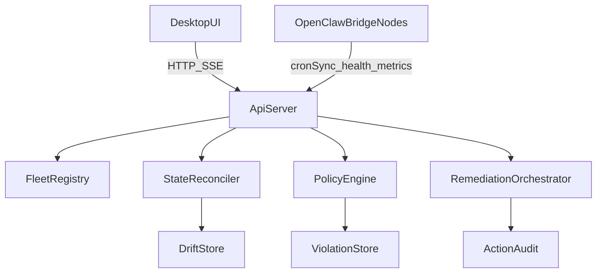

# Smart OpenClaw Fleet Architecture v2

_Status: Proposed_  
_Last updated: 2026-02-26_

## Goals

Upgrade `patze-control` from monitor-first to smart fleet control plane for multi-node OpenClaw operations:

- detect and classify drift early,
- enforce fleet-wide policies,
- provide safe one-click remediation,
- reduce operator toil with automation and guardrails.

## Non-Goals

- No remote arbitrary code execution.
- No replacement of OpenClaw CLI authoring flow.
- No Kubernetes-style orchestration complexity.

## Architecture



## Core Model

```ts
type FleetTarget = {
  id: string;
  name: string;
  transport: 'reverse_ssh' | 'direct_https' | 'hybrid';
  environment: 'local' | 'vps' | 'cloud';
  policyProfileId: string;
  desired: DesiredState;
  reported?: ReportedState;
  fleetHealthScore?: number;
  riskLevel?: 'low' | 'medium' | 'high' | 'critical';
  lastSeenAt?: string;
};

type DesiredState = {
  bridgeVersion: string;
  configHash: string;
  maxSyncLagMs: number;
  allowAutoRemediation: boolean;
  requiredCapabilities: string[];
};

type ReportedState = {
  bridgeVersion: string;
  configHash: string;
  syncLagMs: number;
  heartbeatAt: string;
  healthStatus: 'ok' | 'warn' | 'error';
  metrics: {
    cpuPct?: number;
    memUsedBytes?: number;
    queueDepth?: number;
    failedPushes1h?: number;
  };
};

type DriftRecord = {
  targetId: string;
  category: 'version' | 'config' | 'sync' | 'runtime';
  severity: 'minor' | 'major' | 'critical';
  expected: string;
  actual: string;
  detectedAt: string;
};

type PolicyViolation = {
  id: string;
  targetId: string;
  code: string;
  severity: 'warning' | 'high' | 'critical';
  message: string;
  suggestedPlaybookId?: string;
  createdAt: string;
};
```

## API Contract (Proposed)

### Fleet

- `GET /fleet/targets`
- `GET /fleet/targets/:targetId`
- `PATCH /fleet/targets/:targetId/desired-state`
- `GET /fleet/targets/:targetId/drift`
- `GET /fleet/targets/:targetId/health-score`

### Policy

- `GET /fleet/policies`
- `POST /fleet/policies`
- `PATCH /fleet/policies/:policyId`
- `POST /fleet/targets/:targetId/apply-policy`
- `GET /fleet/violations`

### Remediation

- `POST /fleet/targets/:targetId/reconcile`
- `GET /fleet/remediations/runs/:runId`
- `POST /fleet/remediations/runs/:runId/approve`
- `POST /fleet/remediations/runs/:runId/cancel`

### SSE Events

- `fleet-health-changed`
- `drift-detected`
- `policy-violation`
- `remediation-status`
- `target-offline`

## Scoring + Drift Rules

## Fleet Health Score (0-100)

- connectivity: 20
- sync freshness: 20
- policy compliance: 20
- runtime health: 20
- job stability trend: 20

Bands:

- `90-100`: healthy
- `70-89`: warning
- `40-69`: degraded
- `<40`: critical

## Drift Severity

- `minor`: retry/reload candidate
- `major`: needs operator action
- `critical`: isolate and require explicit approval

## Smart Remediation Playbooks

### BridgeStuck

1. check stale heartbeat threshold,
2. attempt safe restart,
3. verify `/health` and `/metrics`,
4. force reconcile snapshot,
5. log action outcome with evidence.

### ConfigDrift

1. compare desired/reported hash,
2. apply safe mirror update,
3. trigger SIGHUP-based reload path,
4. verify convergence within timeout,
5. rollback when mismatch persists.

### FailureBurst

1. detect fail-rate anomaly,
2. throttle selected jobs,
3. run health doctor checks,
4. gradually resume with guardrail window.

## Rollout Plan

### P0: Read-Only Intelligence

- health score endpoints,
- drift records + SSE events,
- monitor/tunnels surfacing.

### P1: Controlled Actions

- policy profiles + violations view,
- one-click manual reconcile,
- action audit timeline.

### P2: Automation

- batch ops (bounded),
- anomaly-triggered low-risk remediation,
- notification routing and escalation.

## Risk Controls

- safe action scope only (`restart`, `reload`, `reconcile`),
- approval gate for critical actions,
- idempotency key for reconcile/batch operations,
- bounded retry with exponential backoff,
- blast-radius guard for batch size/concurrency,
- full actor/reason/outcome audit.

## Feature Flags

- `SMART_FLEET_V2_ENABLED` (backend): enable/disable `/fleet/*` APIs and fleet SSE signal emission.
- `SMART_FLEET_MAX_SYNC_LAG_MS` (backend): policy threshold for sync-lag drift scoring.
- `SMART_FLEET_MIN_BRIDGE_VERSION` (backend): optional minimum bridge version policy.
- `VITE_SMART_FLEET_V2_ENABLED` (desktop): show/hide Smart Fleet UI and client polling.

## Acceptance Criteria

### P0

- API returns per-target health score and drift detail.
- drift events emit within polling window.
- UI surfaces score/drift without breaking existing telemetry views.

### P1

- policy violations are visible with severity and hints.
- reconcile action is traceable end-to-end.
- no new remote code execution path is introduced.

### P2

- batch actions are idempotent and bounded.
- anomaly alerts are classified and actionable.
- rollout supports progressive enablement via feature flags.
